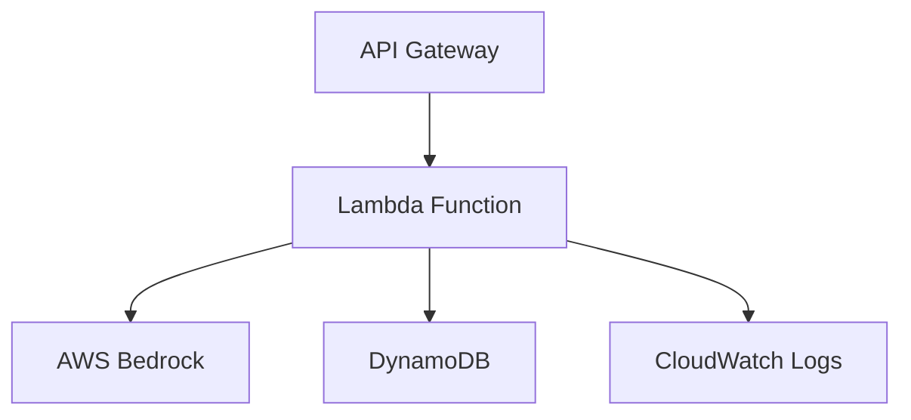

# Smart Customer Support Classifier

An AI-powered customer support query classifier using AWS Bedrock and DynamoDB. This application automatically categorizes customer support queries into predefined categories using AWS Bedrock's AI capabilities and stores the classification history in DynamoDB.

## Architecture



### AWS Services Used

1. **API Gateway**
   - REST API endpoints for query analysis, history retrieval, and statistics
   - Endpoints:
     - POST /analyze - Analyze customer support queries
     - GET /history - Retrieve classification history
     - GET /stats - Get classification statistics

2. **Lambda Function**
   - Node.js 18.x runtime
   - Handles request processing and business logic
   - Integrates with AWS Bedrock and DynamoDB
   - Memory: 256MB
   - Timeout: 30 seconds

3. **AWS Bedrock**
   - AI model for query classification
   - Used for natural language processing and categorization
   - Requires appropriate IAM permissions

4. **DynamoDB**
   - Table: `support-classifications`
   - Schema:
     - Partition Key: `query_id` (String)
   - Billing Mode: PAY_PER_REQUEST
   - Stores classification history and results

5. **CloudWatch**
   - Logs Lambda function execution
   - Monitors application performance
   - Tracks errors and debugging information

## Prerequisites

- Node.js 18.x or later
- AWS CLI configured with appropriate credentials
- Docker Desktop (for local development)
- AWS SAM CLI
- AWS Account with access to:
  - AWS Bedrock
  - DynamoDB
  - Lambda
  - API Gateway
  - CloudWatch

## Local Development Setup

1. Install dependencies:
   ```bash
   npm install
   ```

2. Build the TypeScript code:
   ```bash
   npm run build
   ```

3. Build the SAM application:
   ```bash
   npm run sam:build
   ```

4. Start the local API server:
   ```bash
   sam local start-api
   ```

5. Test the endpoints:
   ```bash
   # Analyze a query
   curl -X POST http://127.0.0.1:3000/analyze \
     -H "Content-Type: application/json" \
     -d '{"query": "I cannot log in to my account"}'

   # Get classification history
   curl http://127.0.0.1:3000/history

   # Get classification statistics
   curl http://127.0.0.1:3000/stats
   ```

## Deployment

1. Deploy to AWS:
   ```bash
   npm run sam:deploy
   ```

2. Follow the guided deployment process in the SAM CLI

## Environment Variables

- `DYNAMODB_TABLE`: DynamoDB table name for storing classifications

## IAM Permissions

The Lambda function requires the following permissions:
- DynamoDB CRUD operations on the `support-classifications` table
- AWS Bedrock `InvokeModel` permission
- CloudWatch Logs permissions

## Project Structure

```
.
├── src/
│   ├── handlers/         # Lambda function handlers
│   ├── services/         # Business logic services
│   ├── utils/           # Utility functions
│   └── index.ts         # Main entry point
├── template.yaml        # SAM template
├── package.json         # Project dependencies
└── tsconfig.json        # TypeScript configuration
```

## Testing

Run the test suite:
```bash
npm test
```

## Contributing

1. Fork the repository
2. Create a feature branch
3. Commit your changes
4. Push to the branch
5. Create a Pull Request

## License

This project is licensed under the MIT License - see the LICENSE file for details. 